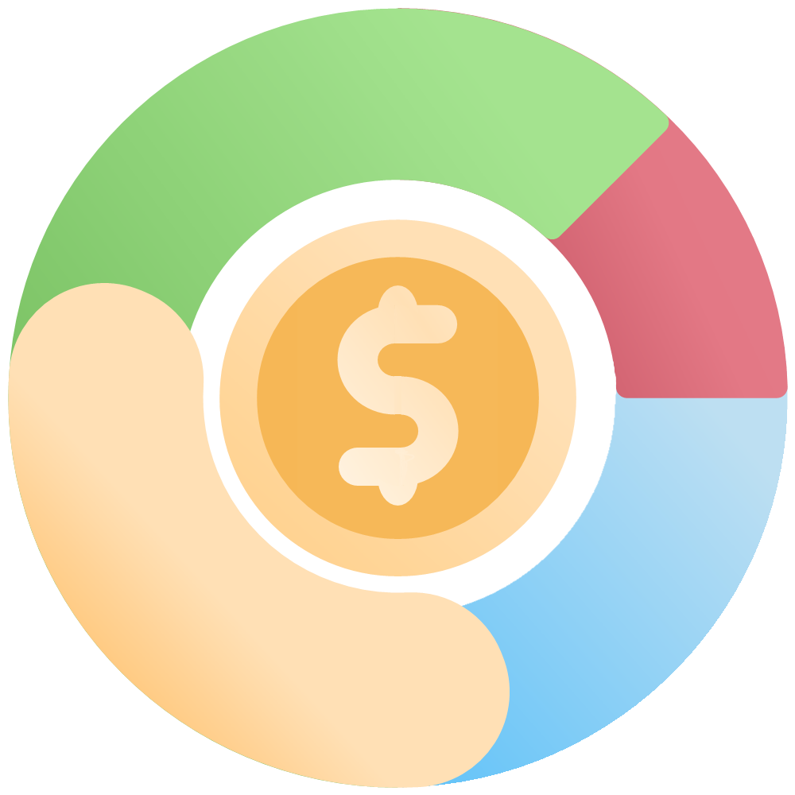
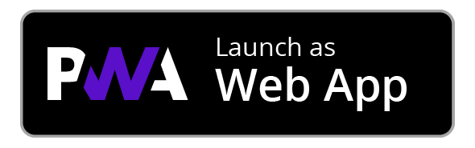
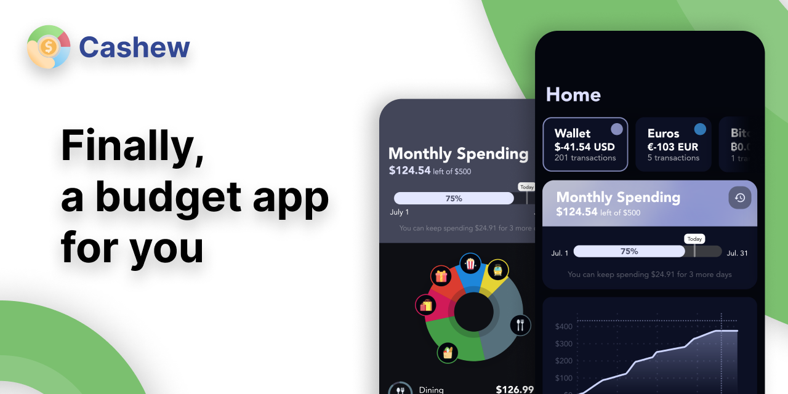
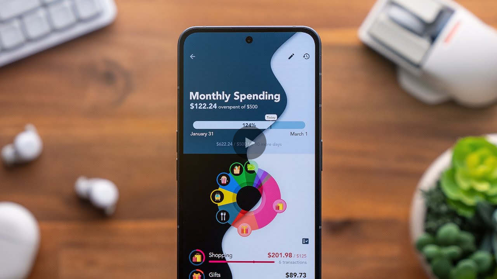
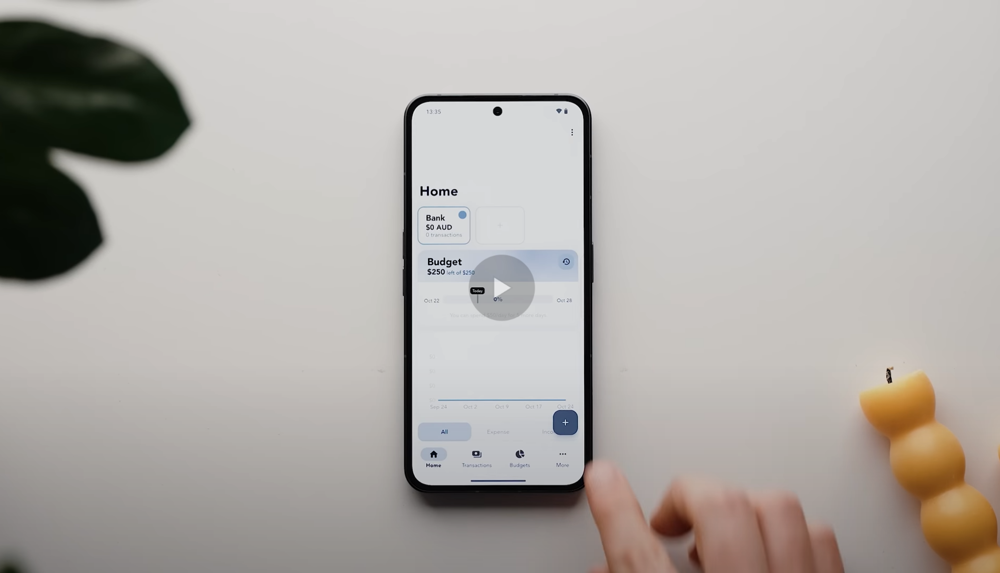
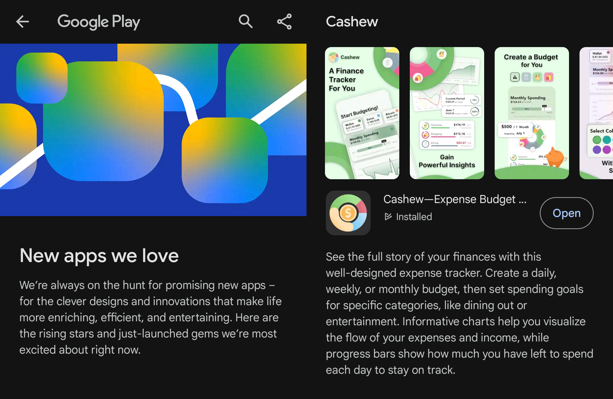
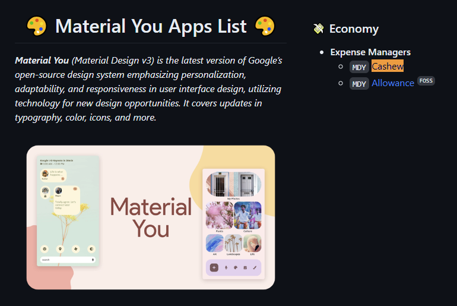

<h1 align="center" style="font-size:28px; line-height:1"><b>Cashew</b></h1>

<a href="https://cashewapp.web.app/">
  <div align="center">
    
  </div>
</a>

<br />

<div align="center">
  <a href="https://apps.apple.com/us/app/cashew-expense-budget-tracker/id6463662930">
    
  </a>
  <a href="https://play.google.com/store/apps/details?id=com.budget.tracker_app">
    
  </a>
  <a href="https://github.com/jameskokoska/Cashew/releases/">
    
  </a>
  <a href="https://budget-track.web.app/">
    
  </a>
</div>

<br />

<a href="https://cashewapp.web.app/">
  <div align="center">
    
  </div>
</a>

<br />

---

Cashew is a full-fledged, feature-rich application designed to empower users in managing their finances effectively. Built using Flutter - with Drift's SQL package, and Firebase - this app offers a seamless and intuitive user experience across various devices. Development started in September 2021.

---

## Features

<a href="https://www.youtube.com/watch?v=Oar9pkc7BSc&t=235s">
  <div align="center">
    
  </div>
</a>
<p align="center">
  Cashew was featured on <a href="https://www.youtube.com/watch?v=Oar9pkc7BSc&t=235s">YouTube</a> on 'The Best Free and Open Source Apps in 2024!' (and in the thumbnail!)
</p>

<br />

<a href="https://www.youtube.com/watch?v=NYZd7IKn1oY&t=536s">
  <div align="center">
    
  </div>
</a>
<p align="center">
  Cashew was featured on <a href="https://www.youtube.com/watch?v=NYZd7IKn1oY&t=536s">YouTube</a> on 'The Best Apps of 2023!'
</p>

<br>

<a href="https://www.youtube.com/watch?v=2MwWmqcn--s&t=261s">
  <div align="center">
    
  </div>
</a>
<p align="center">
  Cashew was featured on <a href="https://www.youtube.com/watch?v=2MwWmqcn--s&t=261s">YouTube</a> on 'Top Android Apps! (November 2023)'
</p>

<br>

<div align="center">
  
</div>
<p align="center">
  Cashew was featured on <a href="https://play.google.com/store/apps/editorial?id=mc_apps_new_on_play_fcp">Google Play's Editorial 'New Apps We Love'</a> (November 2023)!
</p>

<br>

<a href="https://github.com/nyas1/Material-You-app-list?tab=readme-ov-file#-economy:~:text=MDY%20Celenganku-,MDY%20Cashew,-MDY%20Allowance%20FOSS">
  <div align="center">
    
  </div>
</a>
<p align="center">
  Cashew was featured in the <a href="https://github.com/nyas1/Material-You-app-list?tab=readme-ov-file#-economy:~:text=MDY%20Celenganku-,MDY%20Cashew,-MDY%20Allowance%20FOSS">Material You Apps List</a>!
</p>

## Release

Check out the [official website](https://cashewapp.web.app/)!

This application is available on the [App Store](https://apps.apple.com/us/app/cashew-expense-budget-tracker/id6463662930), [Google Play](https://play.google.com/store/apps/details?id=com.budget.tracker_app), [GitHub](https://github.com/jameskokoska/Cashew/releases/) and as a [Web App (PWA)](https://budget-track.web.app/).

### Changelog

Changes and progress about development is all heavily documented in GitHub [commits](https://github.com/jameskokoska/Cashew/commits/main) and in the [changelog](https://github.com/jameskokoska/Cashew/blob/main/budget/lib/widgets/showChangelog.dart)

## Key Features

### 💸 Budget Management

- Custom Budgets and Time Periods: Set up personalized budgets with flexible time periods, such as monthly, weekly, daily, or any custom time period that suits your financial planning needs. A custom time period is useful if you plan on setting a one-time travel budget!
- Added Budgets: Selectively add transactions to specific budgets, allowing you to focus on specific expense categories.
- Category Spending Limits per Budget: Set limits for each category within a budget, ensuring responsible spending.
- Past Budget History Viewing: Analyze your spending habits over time by accessing past budget history, enabling comparison and tracking of financial progress.
- Goals: Create spending and saving goals and put transactions towards different purchases or savings. Track your progress towards achieving your financial goals.

### 💰 Transaction Management

- Support for Different Transaction Types: Categorize transactions effectively based on types such as upcoming, subscription, repeating, debts (borrowed), and credit (lent). Each type behaves in certain ways in the interface. Pay your upcoming transactions when you're ready, or mark your lent out transactions as collected.
- Custom Categories: Create personalized categories to organize transactions according to your unique spending habits. Search through multiple icons and select the default option as expenses or income when adding transactions.
- Custom Titles: Automatically assign transactions with the same name to specific categories, saving time and ensuring consistency. These titles are stored in memory and popup when you add another transaction with a similar name.
- Search and Filters: Easily search and filter transactions based on various criteria such as date, category, amount, or custom tags, enabling quick access to information.
- Easy Editing: Long-press and swipe to select multiple budgets, edit accordingly as needed or delete multiple at once.

### 💱 Financial Flexibility

- Multiple Currencies and Accounts: Manage finances across different currencies and accounts with up-to-date conversion rates for accurate calculations and effortless currency conversions. The interface shows the original amount added and the converted amount to the selected account.
- Switch Accounts and Currencies with Ease: On the homepage, easily select a different account and currency and everything will be converted automatically in an instant.

### 🔒 Enhanced Security and Accessibility

- Biometric Lock: Secure budget data using biometric authentication, adding an extra layer of privacy.
- Google Login: Conveniently log in to the app using your Google account, ensuring a streamlined and hassle-free authentication process.

### 🎨 User Experience and Design

- Material You Design: Enjoy a visually appealing and modern interface, following the principles of Material You design for a delightful user experience.
- Custom Accent Color: Personalize the app by selecting a custom accent color that suits your style, or follow that of the system.
- Light and Dark Mode: Seamlessly switch between light and dark themes to optimize visibility and reduce eye strain.
- Customizable Home Screen: Tailor the home screen layout and widgets to display the financial information that matters most to you, providing a personalized and efficient dashboard.
- Detailed Graph Visuals: Gain valuable insights into spending patterns through detailed and interactive graphs, visualizing financial data at a glance.
- Beautiful Adaptive UI: A responsive user interface that adapts flawlessly to both web and mobile platforms, providing an immersive and consistent user experience across devices.

### ☁ Backup and Syncing

- Cross-Device Sync: Keep budget data synchronized across all devices, ensuring access to financial information wherever you go.
- Google Drive Backup: Safeguard budget data by utilizing Google Drive's backup functionality, allowing easy restoration of data if needed.

### 💿 Smart Automation

- Notifications: Stay informed about important financial events and receive timely reminders for budget goals, transactions, and upcoming due dates.
- Import CSV Files: Seamlessly import financial data by uploading CSV files, facilitating a smooth transition from other applications or platforms.
- Import Google Sheets: Seamlessly import Google Sheets tables, quickly importing many transactions from a spreadsheet.
- App Links: Automatically create transactions with pre-filled data using app linking (documentation below)

## App Links

Only supported in the Android and Web App versions as of now. Deep links allow direct navigation and automation of actions using application URLs. Some examples are below:

### Examples (for Android)

Ensure Cashew is installed on the device you are launching these URLs from.

#### Example 1: Create an expense transaction for 100 with the category Shopping at the current time

> https://cashewapp.web.app/addTransaction?amount=-100&title=All%20the%20shopping&category=Shopping&notes=Went%20shopping

#### Example 2: Create an income transaction with a missing category at the current time

> https://cashewapp.web.app/addTransaction?amount=100&title=Income&notes=Got%20money

#### Example 3: Open the add transaction page with a custom date with prefilled details

> https://cashewapp.web.app/addTransactionRoute?amount=-50&title=All%20the%20shopping&notes=Went%20shopping&date=2024-03-02

#### Example 4: Create multiple transactions with one link using JSON

> https://cashewapp.web.app/addTransaction?JSON=%7B%22transactions%22%3A%5B%7B%22amount%22%3A%22-100%22%2C%20%22notes%22%3A%22This%20is%20a%20note%22%2C%20%22category%22%3A%22Shopping%22%7D%2C%7B%22amount%22%3A%22-150%22%2C%20%22notes%22%3A%22This%20is%20a%20note%202%22%7D%5D%7D

See `JSON List of Transactions` below to view how the link is formatted.

### Routes

| Routes for Android                          | Routes for Web App                             |
| ------------------------------------------- | ---------------------------------------------- |
| `https://cashewapp.web.app/[Endpoint here]` | `https://budget-track.web.app/[Endpoint here]` |
| `cashew://budget.app/[Endpoint here]`       |                                                |

### Endpoints

| Endpoint               | Description                                                               |
| ---------------------- | ------------------------------------------------------------------------- |
| `/addTransaction`      | Add a new transaction without a UI prompt (unless a category is missing). |
| `/addTransactionRoute` | Open the add new transaction route with information filled in.            |

### Parameters

| Parameter     | Description                                                                                                                                                                                                         | Required | Default         |
| ------------- | ------------------------------------------------------------------------------------------------------------------------------------------------------------------------------------------------------------------- | -------- | --------------- |
| `amount`      | The amount of the transaction. If negative, it represents an expense; if positive, it represents income.                                                                                                            | No       | 0               |
| `title`       | The title of the transaction. If an associated title is found and the category is not set, the associated title's category will be used.                                                                            | No       | Empty string    |
| `notes`       | The notes associated with the transaction.                                                                                                                                                                          | No       | Empty string    |
| `date`        | The date of the transaction. Supported string formats can be found in the `getCommonDateFormats()` method [here](https://github.com/jameskokoska/Cashew/blob/5.2.3%2B328/budget/lib/struct/commonDateFormats.dart). | No       | Current time    |
| `category`    | The name of the category to add the transaction to. Executes a name search, takes the first entry, not case sensitive.                                                                                              | No       | Prompt user     |
| `subcategory` | The name of the subcategory to add the transaction to. If provided, it overwrites the category if a subcategory is found under a main category. Executes a name search, takes the first entry, not case sensitive.  | No       | None            |
| `account`     | The name of the account. Executes a name search, takes the first entry, not case sensitive.                                                                                                                         | No       | Primary account |
| `JSON`        | A list of JSON objects of transactions. If provided, Cashew will import a list/multiple transactions at once. Each JSON object in the list can use any of the aforementioned parameters. The JSON object should be keyed with `transactions` followed by the list of objects. See the example below. | No       | None            |

### JSON List of Transactions
The input JSON for `addTransaction` and `addTransactionRoute` should follow the following format:
```JSON
{
  "transactions":[
    { ... },
    { ... },
    { ... }
  ]
}
```
As an example:
```JSON
{
  "transactions": [
    {
      "amount": "-100",
      "notes": "This is a note",
      "category": "Shopping"
    },
    {
      "amount": "-150",
      "notes": "This is a note 2"
    }
  ]
}
```

Don't forget to encode the JSON in the URL as JSON uses invalid URI characters. Once encoded, the output link would look something like:

> https://cashewapp.web.app/addTransaction?JSON=%7B%22transactions%22%3A%5B%7B%22amount%22%3A%22-100%22%2C%20%22notes%22%3A%22This%20is%20a%20note%22%2C%20%22category%22%3A%22Shopping%22%7D%2C%7B%22amount%22%3A%22-150%22%2C%20%22notes%22%3A%22This%20is%20a%20note%202%22%7D%5D%7D


### Testing

#### Using ADB

You can use ADB to test app links. For example

```shell
adb shell am start -a android.intent.action.VIEW -d "https://cashewapp.web.app/addTransaction?amount=-70\&title=Grocery%20Shopping\&date=2024-03-02\&category=Food\&subcategory=Groceries\&notes=Bought%20fruits%20and%20vegetables\&account=test"
```

#### Using links

You can click links and open them with Cashew. See the example section above to test.

## Bundled Packages

This repository contains, bundled in, modified versions of the discontinued packages listed below. They can be found in the folder `/budget/packages`

- https://pub.dev/packages/implicitly_animated_reorderable_list
- https://pub.dev/packages/sliding_sheet

## Translations

The translations are available here: https://docs.google.com/spreadsheets/d/1QQqt28cmrby6JqxLm-oxUXCuM3alniLJ6IRhcPJDOtk/edit?usp=sharing. If you would like to help translate, please reach out on email: dapperappdeveloper@gmail.com

### To Update Translations

1. Run `budget\assets\translations\generate-translations.py`
2. Restart the application

## Developer Notes

### Pull Requests and Contributions

Unfortunately, I am currently not accepting contributions due to licensing and credits. Since this application turns some profits, I want to avoid any muddy water when it comes to compensation for contributions. You are free to submit an [issue](https://github.com/jameskokoska/Cashew/issues) and I can consider it!

### Android Release

- To build an app-bundle Android release, run `flutter build appbundle --release`

Note: required Android SDK.

### iOS Release

- To build an IPA iOS release, run `flutter build ipa`

Note: requires MacOS.

### Firebase Deployment

- To deploy to firebase, run `firebase deploy`

Note: required Firebase.

### GitHub release

- Create a tag for the current version specified in `pubspec.yaml`
- `git tag <version>`
- Push the tag
- `git push origin <version>`
- Create the release and upload binaries
- https://github.com/jameskokoska/Cashew/releases/new

### Scripts

`deploy_and_build_windows.bat`

- Deploy to Firebase and build the apk and appbundle

`open_release_builds.bat`

- Opens the location of the built apk and appbundle

`update_translations.bat`

- Downloads the latest version of Cashew translations. Runs `budget\assets\translations\generate-translations.py`

### Develop Wirelessly on Android

- `adb tcpip 5555`
- `adb connect <IP>`
- Get the phone's IP by going to `About Phone` > `Status Information` > `IP Address`

### Migrate Database

1. Make any database changes to the schema and tables
2. Bump the schema version
   - Change `int schemaVersionGlobal = ...+1` in `tables.dart`
3. Make sure you are in application root directory
   - `cd .\budget\`
4. Generate database code
   - Run `dart run build_runner build`
5. Export the new schema
   - Generate schema dump for the newly created schema
   - Replace `[schemaVersion]` in the command below with the value of `schemaVersionGlobal`
   - Run `dart run drift_dev schema dump lib\database\tables.dart drift_schemas//drift_schema_v[schemaVersion].json`
   - Read more: https://drift.simonbinder.eu/docs/advanced-features/migrations/#exporting-the-schema
6. Generate step-by-step migrations
   - Run `dart run drift_dev schema steps drift_schemas/ lib\database\schema_versions.dart`
7. Implement migration strategy
   - Edit `await stepByStep(...)` function in `tables.dart` and add the migration strategy for the new version migration

### Get Platform

- Use `getPlatform()` from `functions.dart`
- Since `Platform` is not supported on web, we must create a wrapper and always use this to determine the current platform

### Push Route

- If we want to navigate to a new page, stick to `pushRoute(context, page)` function from `functions.dart`
- It handles the platform routing and `PageRouteBuilder`

### Wallets vs. Accounts

- `Wallets` have been been renamed to `Accounts` on the front-end but internally, the name `Wallet` is still used.

### Objectives vs. Goals

- `Objectives` have been been renamed to `Goals` on the front-end but internally, the name `Objectives` is still used.

### Long Term Loans

- Long term loans create a goal. However, the goals total is not used. Instead the total of the goal is calculated by totalling the proper polarity of transactions of the opposite type. For example, if it was a loan of 100$ lent out, the initial transaction would be 100$ of negative polarity (expense) and that would be the total of the goal. When a payment is made, it is made in the opposite (positive) polarity (income) and added to the total 'paid back'. We can easily find how much is remaining by taking the difference (or the addition including polarities).
